# Método das Correntes nas Malhas

# Interpretação do Circuito

## Esquemático


## Netlist

```text
# U=RIsolve circuit Editor

R:R1 node_a _net1 R="6 Ohm" Temp="20" 
R:R2 _net2 node_c R="4 Ohm" Temp="20" 
Vdc:E1 _net1 _net2 E="2 V"  _net1 _net2 
R:R3 node_a node_b R="8 Ohm" Temp="20" 
R:R4 node_b _net3 R="25 Ohm" Temp="20" 
R:R6 gnd node_d R="10 Ohm" Temp="20" 
Vdc:E2 _net3 node_c E="4 V"  _net3 node_c 
R:R7 node_d _net9 R="10 Ohm" Temp="20" 
R:R8 node_d _net10 R="15 Ohm" Temp="20" 
Idc:I1 node_c _net9 I="0.4 A"  node_c _net9 
Vdc:E3 node_c _net10 E="5 V"  node_c _net10 
Idc:I2 _net7 node_d I="90 mA"  _net7 node_d 
Idc:I3 node_b gnd I="0.1 A"  node_b gnd 
Vdc:E4 node_a gnd E="1 V"  node_a gnd 
R:R5 gnd _net7 R="20 Ohm" Temp="20"
```
## Elementos

### Tabela de Componentes

| Tipo | Referência | Valor Nominal |
|---|---|---|
| Fonte de corrente (CC) | $I_{1}$ | $400\~\mathrm{mA}$ |
| Fonte de corrente (CC) | $I_{2}$ | $90\~\mathrm{mA}$ |
| Fonte de corrente (CC) | $I_{3}$ | $100\~\mathrm{mA}$ |
| Fonte de tensão (CC) | $E_{1}$ | $2\~\mathrm{V}$ |
| Fonte de tensão (CC) | $E_{2}$ | $4\~\mathrm{V}$ |
| Fonte de tensão (CC) | $E_{3}$ | $5\~\mathrm{V}$ |
| Fonte de tensão (CC) | $E_{4}$ | $1\~\mathrm{V}$ |
| Resistência | $R_{1}$ | $6\~\mathrm{\Omega}$ |
| Resistência | $R_{2}$ | $4\~\mathrm{\Omega}$ |
| Resistência | $R_{3}$ | $8\~\mathrm{\Omega}$ |
| Resistência | $R_{4}$ | $25\~\mathrm{\Omega}$ |
| Resistência | $R_{5}$ | $20\~\mathrm{\Omega}$ |
| Resistência | $R_{6}$ | $10\~\mathrm{\Omega}$ |
| Resistência | $R_{7}$ | $10\~\mathrm{\Omega}$ |
| Resistência | $R_{8}$ | $15\~\mathrm{\Omega}$ |

---

## Informações do circuito

**Tipo de Simulação:** DC

### Nós

Neste circuito existem 5 nós e são os seguintes:

| Nó | $I_{Convergentes}$ | $I_{Divergentes}$ |
|---|---|---|
| GND | $I_{2}$ | $I_{3}$, $I_{4}$, $I_{5}$ |
| NA | $I_{5}$ | $I_{6}$, $I_{7}$ |
| NB | $I_{3}$, $I_{7}$ | $I_{8}$ |
| NC | $I_{1}$, $I_{6}$, $I_{8}$ | $I_{9}$ |
| ND | $I_{4}$, $I_{9}$ | $I_{1}$, $I_{2}$ |

### Ramos

Neste circuito existem 9 ramos e são os seguintes:

| Ramo | noP | noN | Componentes |
|---|---|---|---|
| B1 | gnd | node_d | $R6=10\~\mathrm{\Omega}$ |
| B2 | node_d | gnd | $I2=90\~\mathrm{mA}, R5=20\~\mathrm{\Omega}$ |
| B3 | gnd | node_a | $E4=1\~\mathrm{V}$ |
| B4 | gnd | node_b | $I3=100\~\mathrm{mA}$ |
| B5 | node_a | node_c | $E1=2\~\mathrm{V}, R1=6\~\mathrm{\Omega}, R2=4\~\mathrm{\Omega}$ |
| B6 | node_a | node_b | $R3=8\~\mathrm{\Omega}$ |
| B7 | node_b | node_c | $E2=4\~\mathrm{V}, R4=25\~\mathrm{\Omega}$ |
| B8 | node_c | node_d | $E3=5\~\mathrm{V}, R8=15\~\mathrm{\Omega}$ |
| B9 | node_d | node_c | $I1=400\~\mathrm{mA}, R7=10\~\mathrm{\Omega}$ |

### Número de equações

#### Contagem de ramos, nós e fontes de corrente ideais

$$
\begin{aligned}
B &= 9 \\
N &= 5 \\
C &= 3
\end{aligned}
$$

#### Número de equações (malhas principais)

$$
\begin{aligned}
Mp &= B - (N - 1) - C = 9 - (5 - 1) - 3 = 2 \\
\end{aligned}
$$

#### Número de malhas auxiliares (fontes de corrente)

$$
\begin{aligned}
Ma &= C = 3
\end{aligned}
$$

# Escolha das Malhas

## Malhas

Neste circuito existem 21 malhas e são as seguintes:

Cada malha está apresentada pelo seu esquemático e pelos seus constituintes: ramos e componentes

### Malha M1


| Ref | noP | noN | Componentes |
|---|---|---|---|
| B1 | gnd | node_d | R6=10 Ohm |
| B2 | node_d | gnd | I2=90 mA, R5=20 Ohm |

#### Malha M2


| Ref | noP | noN | Componentes |
|---|---|---|---|
| B8 | node_c | node_d | E3=5 V, R8=15 Ohm |
| B9 | node_d | node_c | I1=400 mA, R7=10 Ohm |

#### Malha M3
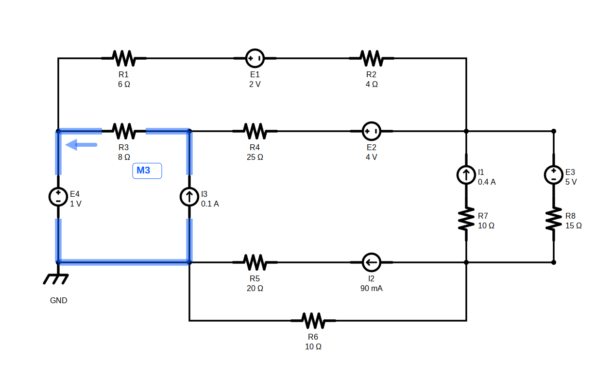

| Ref | noP | noN | Componentes |
|---|---|---|---|
| B4 | gnd | node_b | I3=100 mA |
| B6 | node_a | node_b | R3=8 Ohm |
| B3 | gnd | node_a | E4=1 V |

#### Malha M4


| Ref | noP | noN | Componentes |
|---|---|---|---|
| B6 | node_a | node_b | R3=8 Ohm |
| B7 | node_b | node_c | E2=4 V, R4=25 Ohm |
| B5 | node_a | node_c | E1=2 V, R1=6 Ohm, R2=4 Ohm |

#### Malha M5


| Ref | noP | noN | Componentes |
|---|---|---|---|
| B3 | gnd | node_a | E4=1 V |
| B5 | node_a | node_c | E1=2 V, R1=6 Ohm, R2=4 Ohm |
| B7 | node_b | node_c | E2=4 V, R4=25 Ohm |
| B4 | gnd | node_b | I3=100 mA |

#### Malha M6


| Ref | noP | noN | Componentes |
|---|---|---|---|
| B3 | gnd | node_a | E4=1 V |
| B5 | node_a | node_c | E1=2 V, R1=6 Ohm, R2=4 Ohm |
| B8 | node_c | node_d | E3=5 V, R8=15 Ohm |
| B1 | gnd | node_d | R6=10 Ohm |

#### Malha M7
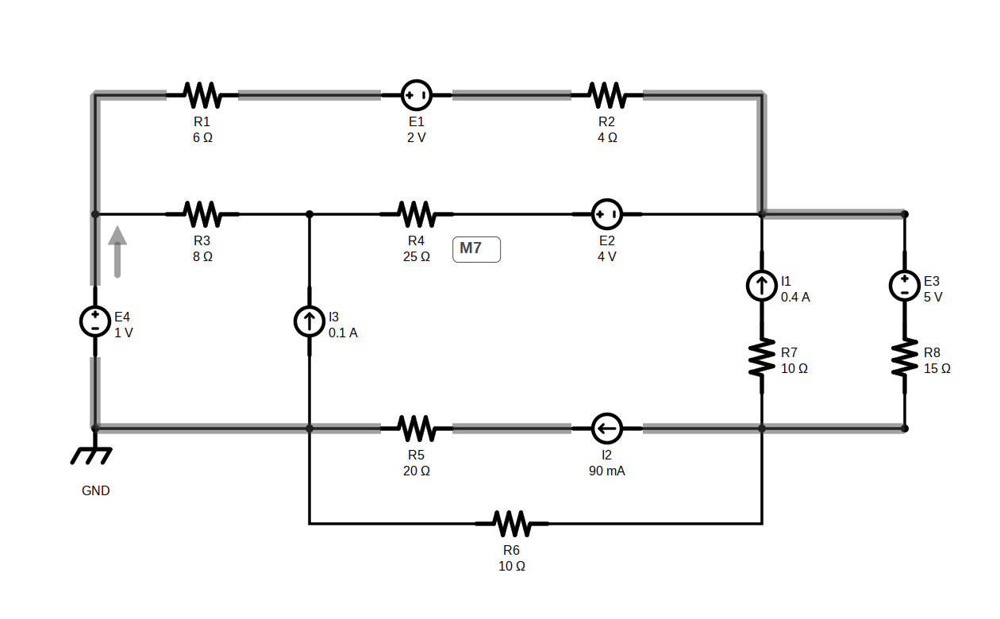

| Ref | noP | noN | Componentes |
|---|---|---|---|
| B3 | gnd | node_a | E4=1 V |
| B5 | node_a | node_c | E1=2 V, R1=6 Ohm, R2=4 Ohm |
| B8 | node_c | node_d | E3=5 V, R8=15 Ohm |
| B2 | node_d | gnd | I2=90 mA, R5=20 Ohm |

#### Malha M8
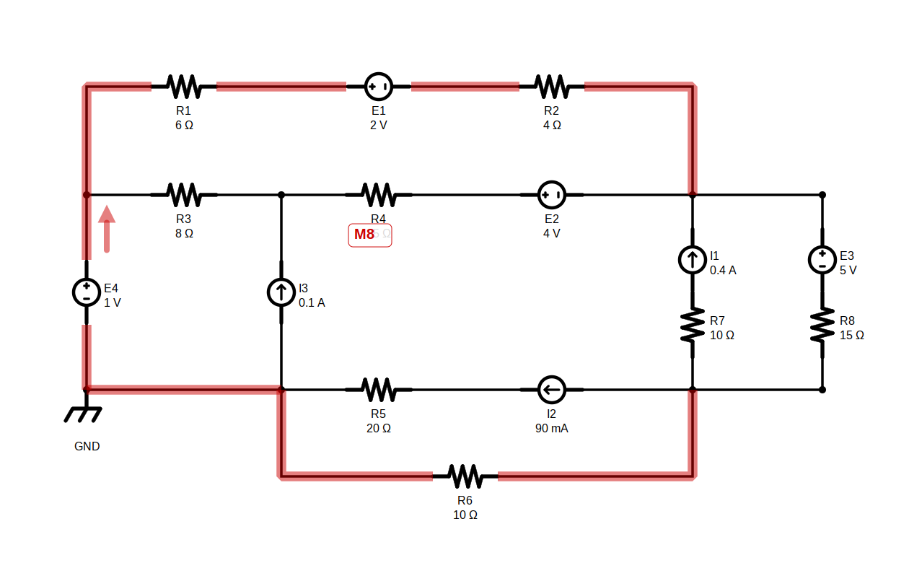

| Ref | noP | noN | Componentes |
|---|---|---|---|
| B3 | gnd | node_a | E4=1 V |
| B5 | node_a | node_c | E1=2 V, R1=6 Ohm, R2=4 Ohm |
| B9 | node_d | node_c | I1=400 mA, R7=10 Ohm |
| B1 | gnd | node_d | R6=10 Ohm |

#### Malha M9


| Ref | noP | noN | Componentes |
|---|---|---|---|
| B3 | gnd | node_a | E4=1 V |
| B5 | node_a | node_c | E1=2 V, R1=6 Ohm, R2=4 Ohm |
| B9 | node_d | node_c | I1=400 mA, R7=10 Ohm |
| B2 | node_d | gnd | I2=90 mA, R5=20 Ohm |

#### Malha M10
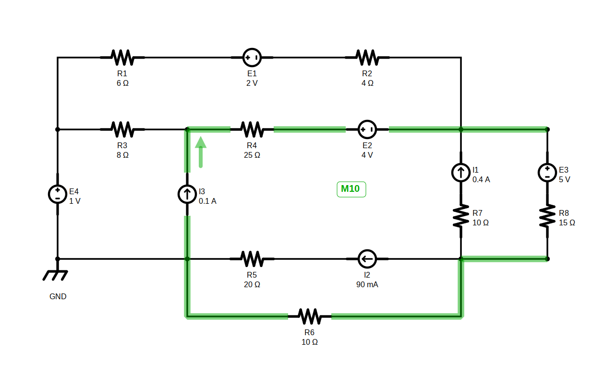

| Ref | noP | noN | Componentes |
|---|---|---|---|
| B4 | gnd | node_b | I3=100 mA |
| B7 | node_b | node_c | E2=4 V, R4=25 Ohm |
| B8 | node_c | node_d | E3=5 V, R8=15 Ohm |
| B1 | gnd | node_d | R6=10 Ohm |

#### Malha M11
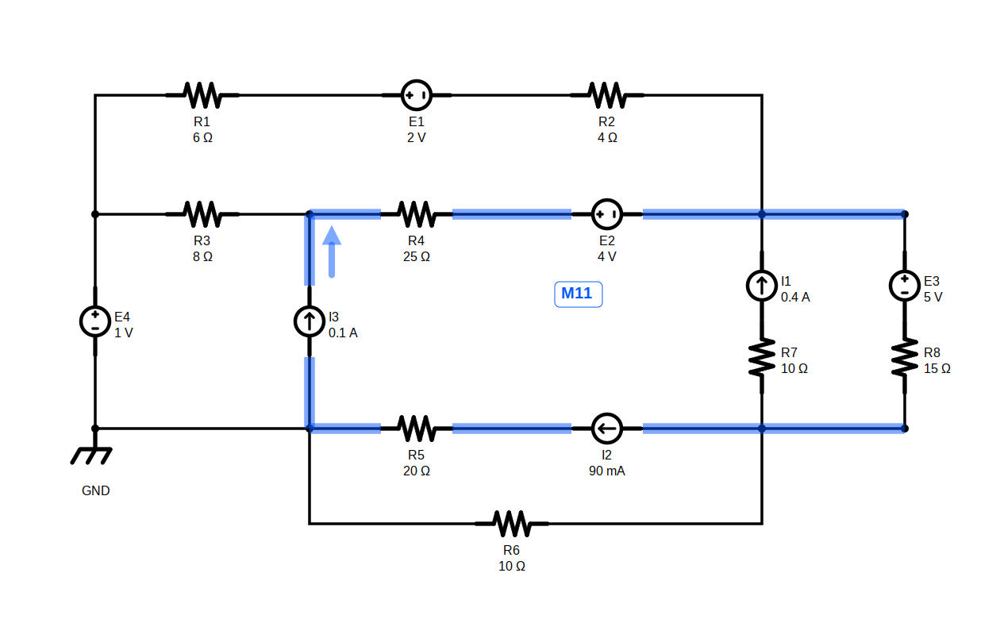

| Ref | noP | noN | Componentes |
|---|---|---|---|
| B4 | gnd | node_b | I3=100 mA |
| B7 | node_b | node_c | E2=4 V, R4=25 Ohm |
| B8 | node_c | node_d | E3=5 V, R8=15 Ohm |
| B2 | node_d | gnd | I2=90 mA, R5=20 Ohm |

#### Malha M12


| Ref | noP | noN | Componentes |
|---|---|---|---|
| B4 | gnd | node_b | I3=100 mA |
| B7 | node_b | node_c | E2=4 V, R4=25 Ohm |
| B9 | node_d | node_c | I1=400 mA, R7=10 Ohm |
| B1 | gnd | node_d | R6=10 Ohm |

#### Malha M13


| Ref | noP | noN | Componentes |
|---|---|---|---|
| B4 | gnd | node_b | I3=100 mA |
| B7 | node_b | node_c | E2=4 V, R4=25 Ohm |
| B9 | node_d | node_c | I1=400 mA, R7=10 Ohm |
| B2 | node_d | gnd | I2=90 mA, R5=20 Ohm |

#### Malha M14


| Ref | noP | noN | Componentes |
|---|---|---|---|
| B3 | gnd | node_a | E4=1 V |
| B6 | node_a | node_b | R3=8 Ohm |
| B7 | node_b | node_c | E2=4 V, R4=25 Ohm |
| B8 | node_c | node_d | E3=5 V, R8=15 Ohm |
| B1 | gnd | node_d | R6=10 Ohm |

#### Malha M15
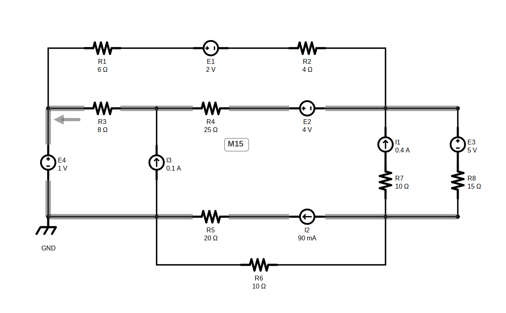

| Ref | noP | noN | Componentes |
|---|---|---|---|
| B3 | gnd | node_a | E4=1 V |
| B6 | node_a | node_b | R3=8 Ohm |
| B7 | node_b | node_c | E2=4 V, R4=25 Ohm |
| B8 | node_c | node_d | E3=5 V, R8=15 Ohm |
| B2 | node_d | gnd | I2=90 mA, R5=20 Ohm |

#### Malha M16


| Ref | noP | noN | Componentes |
|---|---|---|---|
| B3 | gnd | node_a | E4=1 V |
| B6 | node_a | node_b | R3=8 Ohm |
| B7 | node_b | node_c | E2=4 V, R4=25 Ohm |
| B9 | node_d | node_c | I1=400 mA, R7=10 Ohm |
| B1 | gnd | node_d | R6=10 Ohm |

#### Malha M17


| Ref | noP | noN | Componentes |
|---|---|---|---|
| B3 | gnd | node_a | E4=1 V |
| B6 | node_a | node_b | R3=8 Ohm |
| B7 | node_b | node_c | E2=4 V, R4=25 Ohm |
| B9 | node_d | node_c | I1=400 mA, R7=10 Ohm |
| B2 | node_d | gnd | I2=90 mA, R5=20 Ohm |

#### Malha M18


| Ref | noP | noN | Componentes |
|---|---|---|---|
| B4 | gnd | node_b | I3=100 mA |
| B6 | node_a | node_b | R3=8 Ohm |
| B5 | node_a | node_c | E1=2 V, R1=6 Ohm, R2=4 Ohm |
| B8 | node_c | node_d | E3=5 V, R8=15 Ohm |
| B1 | gnd | node_d | R6=10 Ohm |

#### Malha M19


| Ref | noP | noN | Componentes |
|---|---|---|---|
| B4 | gnd | node_b | I3=100 mA |
| B6 | node_a | node_b | R3=8 Ohm |
| B5 | node_a | node_c | E1=2 V, R1=6 Ohm, R2=4 Ohm |
| B8 | node_c | node_d | E3=5 V, R8=15 Ohm |
| B2 | node_d | gnd | I2=90 mA, R5=20 Ohm |

#### Malha M20
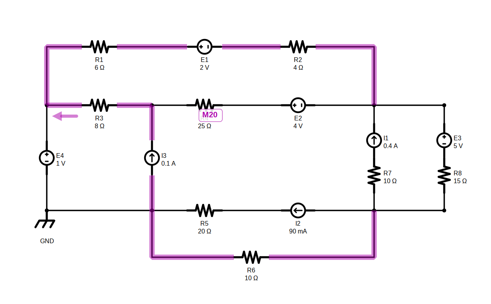

| Ref | noP | noN | Componentes |
|---|---|---|---|
| B4 | gnd | node_b | I3=100 mA |
| B6 | node_a | node_b | R3=8 Ohm |
| B5 | node_a | node_c | E1=2 V, R1=6 Ohm, R2=4 Ohm |
| B9 | node_d | node_c | I1=400 mA, R7=10 Ohm |
| B1 | gnd | node_d | R6=10 Ohm |

#### Malha M21
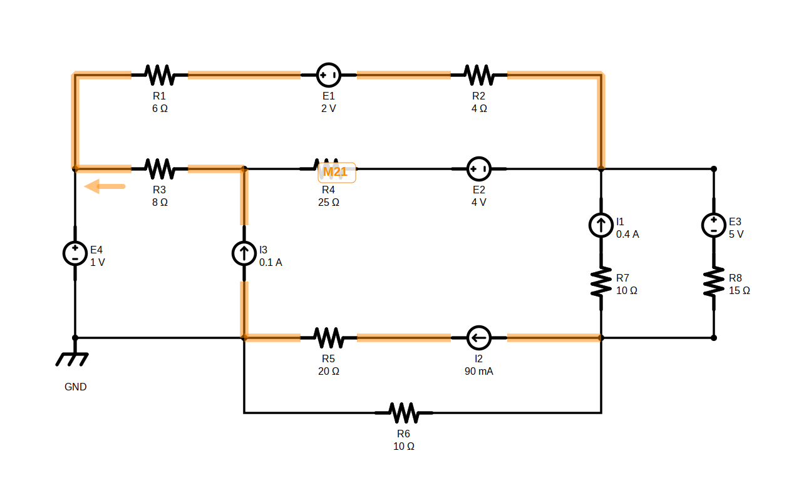

| Ref | noP | noN | Componentes |
|---|---|---|---|
| B4 | gnd | node_b | I3=100 mA |
| B6 | node_a | node_b | R3=8 Ohm |
| B5 | node_a | node_c | E1=2 V, R1=6 Ohm, R2=4 Ohm |
| B9 | node_d | node_c | I1=400 mA, R7=10 Ohm |
| B2 | node_d | gnd | I2=90 mA, R5=20 Ohm |

# Escrita das equações

## Malhas escolhidas

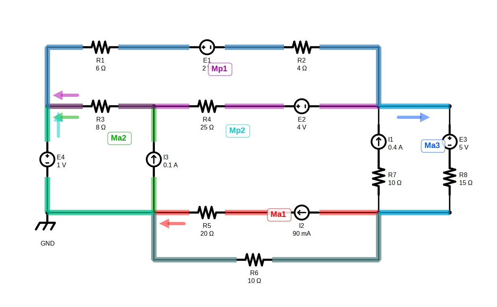

## Sistema de Equações Final

$$
\begin{cases}
-E2+E1=R3\cdot(-I_{Ma2}+I_{Mp1})+R4\cdot(I_{Mp1})+R2\cdot(I_{Mp1}-I_{Mp2})+R1\cdot(I_{Mp1}-I_{Mp2}) \\
E4-E1-E3=R1\cdot(-I_{Mp1}+I_{Mp2})+R2\cdot(-I_{Mp1}+I_{Mp2})+R8\cdot(I_{Ma3}+I_{Mp2})+R6\cdot(-I_{Ma1}+I_{Mp2})
\end{cases}
$$

## Correntes de malha (resultado)

$$
\begin{aligned}
Mp_{1} &= -108,9 mA \\
Mp_{2} &= -348,3 mA
\end{aligned}
$$

# Cálculo das correntes

## Visualização das Correntes

### Visualização Independente

#### Corrente I1


#### Corrente I2

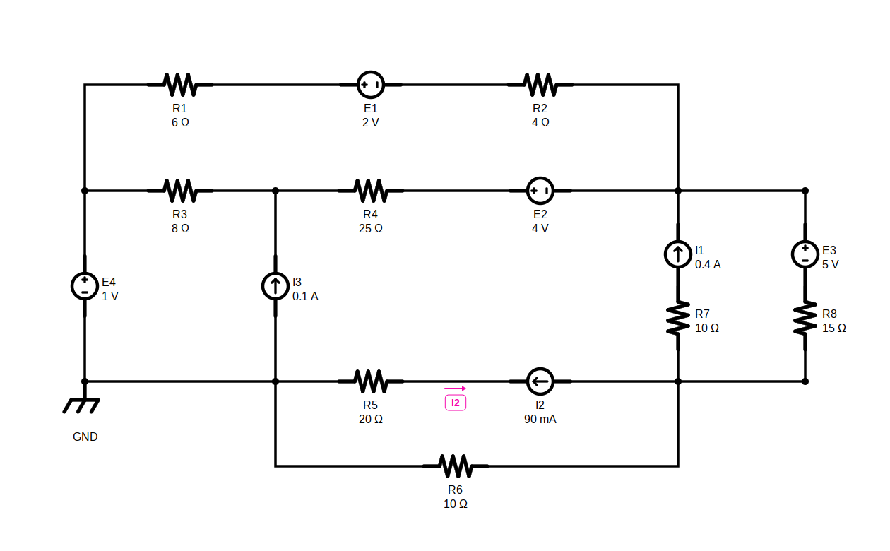

#### Corrente I3

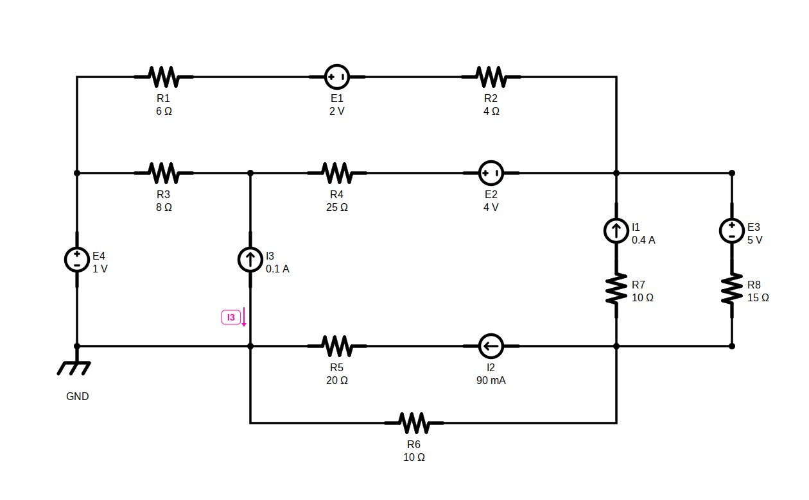

#### Corrente I4


#### Corrente I5


#### Corrente I6

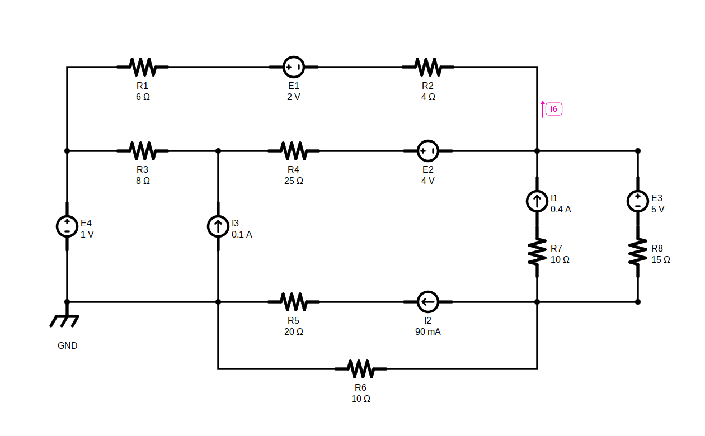

#### Corrente I7


#### Corrente I8


#### Corrente I9


### Visualização de todas as Correntes

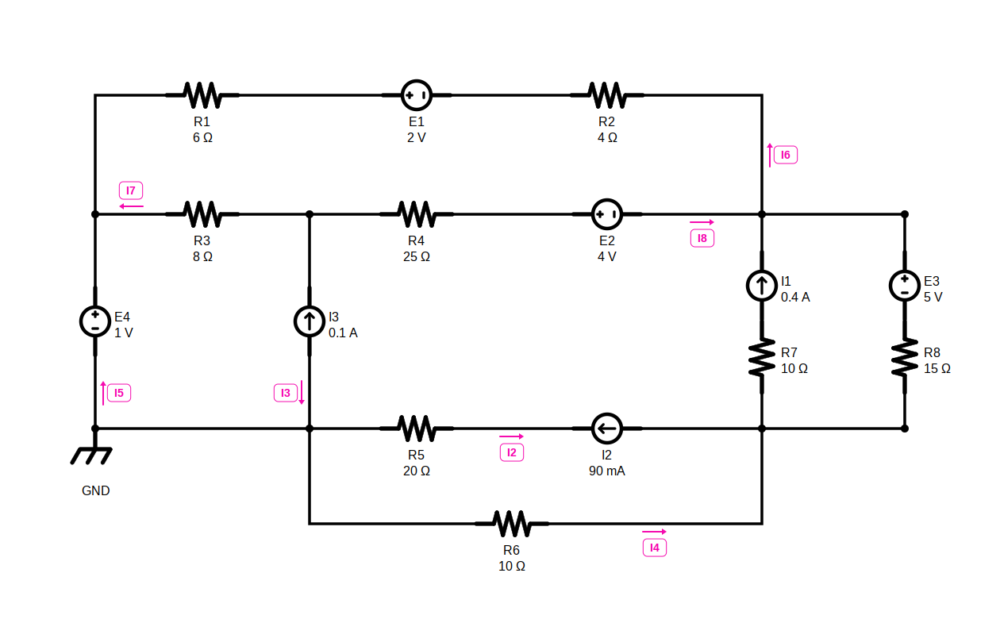


## Valores das correntes

| Ramo | noP -> noN | Relação de malhas | Valor (fasor, 4 alg. sig.) | Amigável |
|---|---|---|---:|---:|
| I1 | node_d -> node_c | $I1=I\_{Ma3}$ | $400 mA$ | $400 mA$ |
| I2 | node_d -> gnd | $I2=I\_{Ma1}$ | $90 mA$ | $90 mA$ |
| I3 | gnd -> node_b | $I3=I\_{Ma2}$ | $100 mA$ | $100 mA$ |
| I4 | gnd -> node_d | $I4=I\_{Ma1}-I\_{Mp2}$ | $438,3 mA$ | $438 mA$ |
| I5 | gnd -> node_a | $I5=-I\_{Ma2}+I\_{Mp2}$ | $-448,3 mA$ | $-448 mA$ |
| I6 | node_a -> node_c | $I6=-I\_{Mp1}+I\_{Mp2}$ | $-239,4 mA$ | $-239 mA$ |
| I7 | node_a -> node_b | $I7=-I\_{Ma2}+I\_{Mp1}$ | $-208,9 mA$ | $-209 mA$ |
| I8 | node_b -> node_c | $I8=I\_{Mp1}$ | $-108,9 mA$ | $-109 mA$ |
| I9 | node_c -> node_d | $I9=I\_{Ma3}+I\_{Mp2}$ | $51,74 mA$ | $51,7 mA$ |
